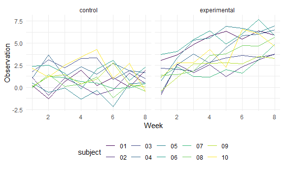

Homework 5
================
Jessica Flynn

``` r
library(tidyverse)
```

    ## -- Attaching packages --------------------------------------- tidyverse 1.3.0 --

    ## v ggplot2 3.3.2     v purrr   0.3.4
    ## v tibble  3.0.3     v dplyr   1.0.2
    ## v tidyr   1.1.2     v stringr 1.4.0
    ## v readr   1.3.1     v forcats 0.5.0

    ## -- Conflicts ------------------------------------------ tidyverse_conflicts() --
    ## x dplyr::filter() masks stats::filter()
    ## x dplyr::lag()    masks stats::lag()

``` r
knitr::opts_chunk$set(
  fig.width = 6,
  fig.asp = .6,
  out.width = "90%")

theme_set(theme_minimal() + theme(legend.position = "bottom"))

options(
  ggplot2.continuous.colour = "viridis",
  ggplot2.continuous.fill = "viridis")

scale_colour_discrete = scale_colour_viridis_d
scale_fill_discrete = scale_fill_viridis_d
```

## Problem 1

``` r
homicide_df = 
  read_csv("homicide_data/homicide-data.csv") 
```

    ## Parsed with column specification:
    ## cols(
    ##   uid = col_character(),
    ##   reported_date = col_double(),
    ##   victim_last = col_character(),
    ##   victim_first = col_character(),
    ##   victim_race = col_character(),
    ##   victim_age = col_character(),
    ##   victim_sex = col_character(),
    ##   city = col_character(),
    ##   state = col_character(),
    ##   lat = col_double(),
    ##   lon = col_double(),
    ##   disposition = col_character()
    ## )

The raw data contains information on homicides in 50 large US cities.
The variables include report date, victim’s first and last name, as well
as victim’s race, age and sex. Additionally the database includes
variables for city, state, latitude, longitude, and disposition of the
case. The data has 52179 rows and 12 columns.

Next, we will clean the data. Below, we create a variable `city_state`
that merges the `city` and `state`variables into one variable separated
by an underscore. Additionally, we create a variable called `resolved`
which condenses `disposition` into 2 groups: unsolved and solved.
Lastly, we remove the `city_state` of Tulsa\_AL since this seems to be
an error (Tulsa is on Oklahoma(OK))

``` r
homicide_df = 
  read_csv("homicide_data/homicide-data.csv") %>% 
  mutate( 
    city_state = str_c(city, state, sep = "_"),
    resolved = case_when(
      disposition == "Closed without arrest" ~ "unsolved", 
      disposition =="Open/No arrest" ~ "unsolved", 
      disposition == "Closed by arrest" ~ "solved")
    ) %>%
  select(city_state, resolved ) %>% 
  filter(city_state != "Tulsa_AL")
```

    ## Parsed with column specification:
    ## cols(
    ##   uid = col_character(),
    ##   reported_date = col_double(),
    ##   victim_last = col_character(),
    ##   victim_first = col_character(),
    ##   victim_race = col_character(),
    ##   victim_age = col_character(),
    ##   victim_sex = col_character(),
    ##   city = col_character(),
    ##   state = col_character(),
    ##   lat = col_double(),
    ##   lon = col_double(),
    ##   disposition = col_character()
    ## )

Next, we summarize by city to obtain the total number of homicides and
the number of unsolved homicides in each.

``` r
aggregate_df =
  homicide_df %>%
  group_by(city_state) %>% 
  summarize( 
    hom_total = n(), 
    hom_unsolved = sum(resolved == "unsolved"))
```

    ## `summarise()` ungrouping output (override with `.groups` argument)

``` r
aggregate_df
```

    ## # A tibble: 50 x 3
    ##    city_state     hom_total hom_unsolved
    ##    <chr>              <int>        <int>
    ##  1 Albuquerque_NM       378          146
    ##  2 Atlanta_GA           973          373
    ##  3 Baltimore_MD        2827         1825
    ##  4 Baton Rouge_LA       424          196
    ##  5 Birmingham_AL        800          347
    ##  6 Boston_MA            614          310
    ##  7 Buffalo_NY           521          319
    ##  8 Charlotte_NC         687          206
    ##  9 Chicago_IL          5535         4073
    ## 10 Cincinnati_OH        694          309
    ## # ... with 40 more rows

We will look at Baltimore, MD and use the `prop.test` function to
estimate the proportion of homicides that are unsolved. Below, we will
see a tibble containing `estimate`, `conf.low` and `conf.high` which
represent the estimated proportion of unsolved homicides and its lower
and upper confidence interval bounds, respectively.

``` r
test_output = 
  prop.test(
  aggregate_df %>% filter(city_state == "Baltimore_MD") %>% pull(hom_unsolved), 
  aggregate_df %>% filter(city_state == "Baltimore_MD") %>% pull(hom_total))

test_output %>%
  broom::tidy() %>% 
  select(estimate, conf.low, conf.high)
```

    ## # A tibble: 1 x 3
    ##   estimate conf.low conf.high
    ##      <dbl>    <dbl>     <dbl>
    ## 1    0.646    0.628     0.663

Now, we will look at `prop.test` for each of the cities by using an
iterative process. A resulting tibble will contain the same information
as the tibble above for Baltimore\_MD for each city.

``` r
results_df = 
  aggregate_df %>%
  mutate(
    prop_tests = map2(.x = hom_unsolved, .y = hom_total, ~prop.test(x = .x, n = .y)), 
    tidy_tests = map(.x = prop_tests, ~broom::tidy(.x))
  ) %>% 
  select(-prop_tests) %>% 
  unnest(tidy_tests) %>% 
  select(city_state, estimate, conf.low, conf.high)

results_df
```

    ## # A tibble: 50 x 4
    ##    city_state     estimate conf.low conf.high
    ##    <chr>             <dbl>    <dbl>     <dbl>
    ##  1 Albuquerque_NM    0.386    0.337     0.438
    ##  2 Atlanta_GA        0.383    0.353     0.415
    ##  3 Baltimore_MD      0.646    0.628     0.663
    ##  4 Baton Rouge_LA    0.462    0.414     0.511
    ##  5 Birmingham_AL     0.434    0.399     0.469
    ##  6 Boston_MA         0.505    0.465     0.545
    ##  7 Buffalo_NY        0.612    0.569     0.654
    ##  8 Charlotte_NC      0.300    0.266     0.336
    ##  9 Chicago_IL        0.736    0.724     0.747
    ## 10 Cincinnati_OH     0.445    0.408     0.483
    ## # ... with 40 more rows

A plot of this information for each city is displayed below

``` r
results_df %>% 
  mutate(city_state = fct_reorder(city_state, estimate)) %>%
  ggplot(aes(x = city_state, y = estimate)) + 
  geom_point() + 
  geom_errorbar(aes(ymin = conf.low, ymax = conf.high)) +
  theme(axis.text.x =  element_text(angle = 90, vjust = 0.5, hjust = 1))
```


## Problem 2

For problem 2 we will iterate to read in 20 csv files, each containing
data for a separate subject from a longitudinal study. The study
contained both a control and experimental arm.

We will create a tidy dataframe containing data from all participants,
including the subject ID, arm, and value of the observations over the
weeks.

``` r
lda_data =
  tibble(
  path = list.files("lda_data")) %>%  
  mutate(files = map(path, ~read.csv(file = paste0("./lda_data/",.x)))) %>% 
  unnest(cols = c(files)) %>% 
  pivot_longer(
    cols = week_1:week_8, 
    names_to = "week", 
    names_prefix = "week_", 
    names_transform = list(week = as.numeric)) %>% 
  separate(
    path,
    into = c("arm", "subject"),
    sep = "_") %>%
  mutate(
    arm = case_when(arm == "con" ~"control", 
                    arm == "exp" ~ "experimental"), 
    subject =  str_sub(subject, end = -5))
```

Below, we see a spaghetti plot showing observations on each subject over
time for each arm.

``` r
lda_data %>% 
  ggplot(aes(x = week, y = value, color = subject)) +
  geom_line(aes(group = subject)) + 
  facet_grid(~arm) +
  labs(x = "Week", 
       y = "Observation")
```



We notice that in the control group, the values stay mostly stable
across the weeks. However, for the experimental group, there is a steady
increase in values across the weeks.

## Problem 3
