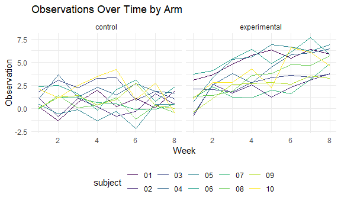

Homework 5
================
Jessica Flynn

``` r
set.seed(1)

library(tidyverse)
```

    ## -- Attaching packages --------------------------------------- tidyverse 1.3.0 --

    ## v ggplot2 3.3.2     v purrr   0.3.4
    ## v tibble  3.0.3     v dplyr   1.0.2
    ## v tidyr   1.1.2     v stringr 1.4.0
    ## v readr   1.3.1     v forcats 0.5.0

    ## -- Conflicts ------------------------------------------ tidyverse_conflicts() --
    ## x dplyr::filter() masks stats::filter()
    ## x dplyr::lag()    masks stats::lag()

``` r
knitr::opts_chunk$set(
  fig.width = 6,
  fig.asp = .6,
  out.width = "90%")

theme_set(theme_minimal() + theme(legend.position = "bottom"))

options(
  ggplot2.continuous.colour = "viridis",
  ggplot2.continuous.fill = "viridis")

scale_colour_discrete = scale_colour_viridis_d
scale_fill_discrete = scale_fill_viridis_d
```

## Problem 1

``` r
homicide_df = 
  read_csv("homicide_data/homicide-data.csv") 
```

    ## Parsed with column specification:
    ## cols(
    ##   uid = col_character(),
    ##   reported_date = col_double(),
    ##   victim_last = col_character(),
    ##   victim_first = col_character(),
    ##   victim_race = col_character(),
    ##   victim_age = col_character(),
    ##   victim_sex = col_character(),
    ##   city = col_character(),
    ##   state = col_character(),
    ##   lat = col_double(),
    ##   lon = col_double(),
    ##   disposition = col_character()
    ## )

The raw data contains information on homicides in 50 large US cities.
The variables include report date, victim’s first and last name, as well
as victim’s race, age and sex. Additionally the database includes
variables for city, state, latitude, longitude, and disposition of the
case. The data has 52179 rows and 12 columns.

Next, we will clean the data. Below, we create a variable `city_state`
that merges the `city` and `state`variables into one variable separated
by an underscore. Additionally, we create a variable called `resolved`
which condenses `disposition` into 2 groups: unsolved and solved.
Lastly, we remove the `city_state` of Tulsa\_AL since this seems to be
an error (Tulsa is on Oklahoma).

``` r
homicide_df = 
  read_csv("homicide_data/homicide-data.csv") %>% 
  mutate( 
    city_state = str_c(city, state, sep = "_"),
    resolved = case_when(
      disposition == "Closed without arrest" ~ "unsolved", 
      disposition =="Open/No arrest" ~ "unsolved", 
      disposition == "Closed by arrest" ~ "solved")
    ) %>%
  select(city_state, resolved ) %>% 
  filter(city_state != "Tulsa_AL")
```

    ## Parsed with column specification:
    ## cols(
    ##   uid = col_character(),
    ##   reported_date = col_double(),
    ##   victim_last = col_character(),
    ##   victim_first = col_character(),
    ##   victim_race = col_character(),
    ##   victim_age = col_character(),
    ##   victim_sex = col_character(),
    ##   city = col_character(),
    ##   state = col_character(),
    ##   lat = col_double(),
    ##   lon = col_double(),
    ##   disposition = col_character()
    ## )

Next, we summarize by city to obtain the total number of homicides and
the number of unsolved homicides in each.

``` r
aggregate_df =
  homicide_df %>%
  group_by(city_state) %>% 
  summarize( 
    hom_total = n(), 
    hom_unsolved = sum(resolved == "unsolved")) %>% 
  print()
```

    ## `summarise()` ungrouping output (override with `.groups` argument)

    ## # A tibble: 50 x 3
    ##    city_state     hom_total hom_unsolved
    ##    <chr>              <int>        <int>
    ##  1 Albuquerque_NM       378          146
    ##  2 Atlanta_GA           973          373
    ##  3 Baltimore_MD        2827         1825
    ##  4 Baton Rouge_LA       424          196
    ##  5 Birmingham_AL        800          347
    ##  6 Boston_MA            614          310
    ##  7 Buffalo_NY           521          319
    ##  8 Charlotte_NC         687          206
    ##  9 Chicago_IL          5535         4073
    ## 10 Cincinnati_OH        694          309
    ## # ... with 40 more rows

We will look at Baltimore, MD and use the `prop.test` function to
estimate the proportion of homicides that are unsolved. Below, we will
see a tibble containing `estimate`, `conf.low` and `conf.high` which
represent the estimated proportion of unsolved homicides and its lower
and upper confidence interval bounds, respectively.

``` r
test_output = 
  prop.test(
  aggregate_df %>% filter(city_state == "Baltimore_MD") %>% pull(hom_unsolved), 
  aggregate_df %>% filter(city_state == "Baltimore_MD") %>% pull(hom_total))

test_output %>%
  broom::tidy() %>% 
  select(estimate, conf.low, conf.high)
```

    ## # A tibble: 1 x 3
    ##   estimate conf.low conf.high
    ##      <dbl>    <dbl>     <dbl>
    ## 1    0.646    0.628     0.663

Now, we will look at `prop.test` for each of the cities by using an
iterative process and the `map2()` and `map()` functions. A resulting
tibble will contain the same information as the tibble above for
Baltimore\_MD for each city.

``` r
results_df = 
  aggregate_df %>%
  mutate(
    prop_tests = map2(.x = hom_unsolved, .y = hom_total, ~prop.test(x = .x, n = .y)), 
    tidy_tests = map(.x = prop_tests, ~broom::tidy(.x))
  ) %>% 
  select(-prop_tests) %>% 
  unnest(tidy_tests) %>% 
  select(city_state, estimate, conf.low, conf.high) %>% 
  print()
```

    ## # A tibble: 50 x 4
    ##    city_state     estimate conf.low conf.high
    ##    <chr>             <dbl>    <dbl>     <dbl>
    ##  1 Albuquerque_NM    0.386    0.337     0.438
    ##  2 Atlanta_GA        0.383    0.353     0.415
    ##  3 Baltimore_MD      0.646    0.628     0.663
    ##  4 Baton Rouge_LA    0.462    0.414     0.511
    ##  5 Birmingham_AL     0.434    0.399     0.469
    ##  6 Boston_MA         0.505    0.465     0.545
    ##  7 Buffalo_NY        0.612    0.569     0.654
    ##  8 Charlotte_NC      0.300    0.266     0.336
    ##  9 Chicago_IL        0.736    0.724     0.747
    ## 10 Cincinnati_OH     0.445    0.408     0.483
    ## # ... with 40 more rows

A plot of this information for each city is displayed below

``` r
results_df %>% 
  mutate(city_state = fct_reorder(city_state, estimate)) %>%
  ggplot(aes(x = city_state, y = estimate)) + 
  geom_point() + 
  geom_errorbar(aes(ymin = conf.low, ymax = conf.high)) +
  theme(axis.text.x =  element_text(angle = 90, vjust = 0.5, hjust = 1))
```


## Problem 2

For problem 2 we will iterate to read in 20 csv files, each containing
data for a separate subject from a longitudinal study. The study
contained both a control and experimental arm.

We will create a tidy dataframe containing data from all subjects,
including the subject ID, arm, and observations over the weeks.

``` r
lda_data =
  tibble(
  path = list.files("lda_data")) %>%  
  mutate(files = map(path, ~read.csv(file = paste0("lda_data/",.x)))) %>% 
  unnest(files) %>% 
  pivot_longer(
    cols = week_1:week_8, 
    names_to = "week", 
    names_prefix = "week_", 
    names_transform = list(week = as.numeric)) %>% 
  separate(
    path,
    into = c("arm", "subject"),
    sep = "_") %>%
  mutate(
    arm = case_when(arm == "con" ~"control", 
                    arm == "exp" ~ "experimental"), 
    subject =  str_sub(subject, end = -5))
```

Below, we see a spaghetti plot showing observations on each subject over
time for each arm.

``` r
lda_data %>% 
  ggplot(aes(x = week, y = value, color = subject)) +
  geom_line(aes(group = subject)) + 
  facet_grid(~arm) +
  labs(title = "Observations Over Time by Arm",
       x = "Week", 
       y = "Observation") 
```



We notice that in the control group, the values stay mostly stable
across the weeks. However, for the experimental group, there is a steady
increase in values across the weeks. Also, we can notice that some of
the experimental subjects (01 and 06) started off with higher values
than the control subjects.

## Problem 3

Power is the probability that a false null hypothesis is rejected. Here,
we will conduct a simulation to explore power in a one-sample t-test.

First, we will create a function that allows us to generate data from
the normal distribution of size n = 30 with parameter sigma = 5. It will
save as output `mu_hat` (the estimated mean parameter) , and `p_value`,
the p-value from a `t.test` with the null hypothesis that μ = 0 at the
alpha = 0.05 level.

``` r
sim_mean = function(n = 30, mu, sigma =5) {
  
  #get normal random sample
  sim_data = tibble(
    x = rnorm(n, mean = mu, sd = sigma),
  )
  
  
  # run t test
  t_test = t.test(sim_data %>% pull(x), mu = 0)
  
  # save p-value
  output <- broom::tidy(t_test) %>% 
    janitor::clean_names() %>% 
    select(p_value)
  
  ## Get mu-hat
  sim_data = 
    sim_data %>% 
    summarize(mu_hat  = mean(x))
  
  #return both values
  return(bind_cols(output, sim_data))
}
```

Now, we will run the function 5,000 times

``` r
sim_results = 
  rerun(5000, sim_mean(mu = 0)) %>% 
  bind_rows() %>% 
  print()
```

    ## # A tibble: 5,000 x 2
    ##    p_value mu_hat
    ##      <dbl>  <dbl>
    ##  1  0.629   0.412
    ##  2  0.368   0.664
    ##  3  0.534   0.551
    ##  4  0.487   0.567
    ##  5  0.0599 -1.65 
    ##  6  0.229   1.19 
    ##  7  0.738   0.334
    ##  8  0.209  -1.19 
    ##  9  0.887   0.122
    ## 10  0.472   0.684
    ## # ... with 4,990 more rows

Repeat for values of μ = {1,2,3,4,5,6}

``` r
sim_mu_vals <- tibble(mu_vals = c(1, 2, 3, 4, 5, 6)) %>% 
  mutate(output = map(.x = mu_vals, ~rerun(5000, sim_mean(mu = .x))), 
         estimate_output = map(output, bind_rows)) %>% 
  select(-output) %>%
  unnest(estimate_output) %>% 
  mutate(sig = p_value < 0.05)
```

Below is a plot showing the proportion of times the null was rejected
(the power of the test) on the y axis and the true value of μ on the x
axis.

``` r
#Combine mu=0 to mu=1,2,3,4,5,6
sim_results =
  sim_results %>% 
  mutate(mu_vals = 0, 
         sig = p_value < 0.05) %>% 
  select(mu_vals, p_value, mu_hat, sig) %>% 
  bind_rows(sim_mu_vals)

## Make plot

sim_results %>% 
  group_by(mu_vals) %>% 
  summarize(prop_sig = mean(sig)) %>% 
  ggplot(aes(x = mu_vals, y = prop_sig)) +
  geom_bar(stat = "identity") +
  labs(title = "Association between Effect Size and Power",
       y = "Power",
       x = "μ (True Value)") +
  scale_y_continuous(lim = c(0, 1)) +
  scale_x_continuous(breaks = seq(0, 6, 1))
```

    ## `summarise()` ungrouping output (override with `.groups` argument)


As the true value of μincreases, so does the power. When the the true
value of μ is close to the value being tested with under null hypothesis
(μ =0), power is low, but as the true μ value becomes further away from
0, the power to detect a difference gradually increases.

Below, is a plot showing the average estimate of μ-hat on the y axis and
the true value of μ on the x axis. The average estimate of μ-hat is
displayed both for all samples, and also only in samples for which the
null (H0) was rejected.

``` r
sim_results %>% 
  group_by(mu_vals) %>% 
  mutate(avg_mu_hat = mean(mu_hat)) %>% 
  filter(sig == TRUE) %>% 
  mutate(avg_mu_hat_sig = mean(mu_hat)) %>%
  distinct(mu_vals, .keep_all = TRUE) %>% 
  select(mu_vals, starts_with("avg")) %>% 
  pivot_longer(avg_mu_hat:avg_mu_hat_sig, 
               names_to = "group") %>%
  ggplot(aes(x = mu_vals, y = value, colour = group)) + 
  geom_line(alpha = 0.5) + 
  labs(x = "μ (True Value)",
       y = "Average Estimate of μ-hat") +
  scale_colour_discrete(name = " ", labels = c("All Samples", "Only Samples when H0 was Rejected"))
```


When the true value of μ is 0, the sample average μ-hat across tests for
which the null is rejected is close to the true value of μ. At this
value,very few tests rejected, and thus we would expect the μ-hat to be
close to μ.

For true μ values of 4,5 and 6, μ-hat among samples in which H0 is
rejected is very close to the true μ. This is because almost all tests
are rejected as these true μ values are far from the null where μ = 0.
Also, since nearly all tests are rejected, we do not see a difference in
μ-hat between all samples and only samples in which H0 is rejected.

For true μ values of 1, and 2, the μ-hat is further away from the true
value. This is because in order for the H0 to be rejected, the μ-hat has
to be far enough away from μ = 0 under H0. We see that average μ-hat for
samples in which H0 is rejected is larger than the average μ-hat across
all samples, and also larger than the true μ
